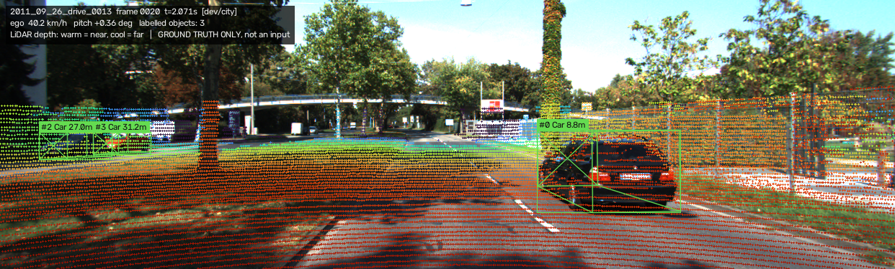
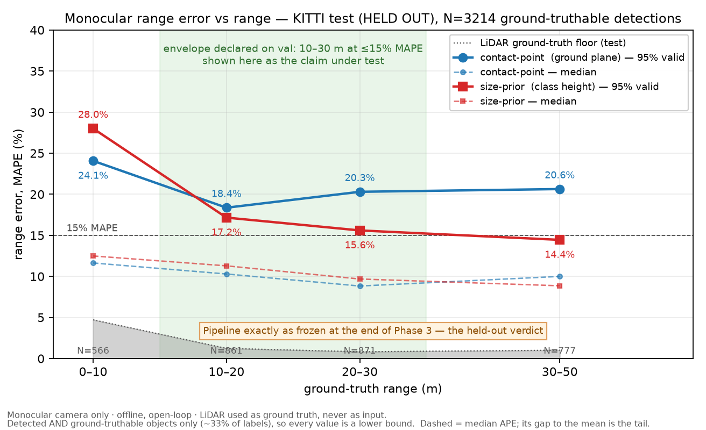
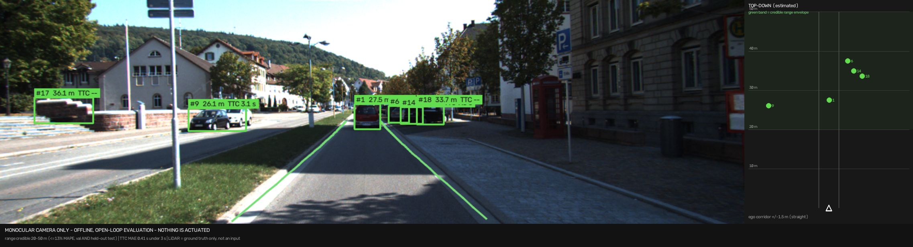

# Autonomous Perception System (APS)

A **monocular** vision perception and forward-collision-warning stack, evaluated
against LiDAR ground truth before anything is claimed about it.

```
KITTI frame ─► detection ─► 2D tracking ─► monocular range ─► scale-rate velocity + KF ─► TTC ─► FCW / AEB-request
            └► lane solver ────────────► lane-departure metric ───────────────────────────────┘
Ground truth: projected LiDAR range
```

## Scope, stated plainly

A **single forward camera**. No LiDAR, no radar, and no fusion in the estimation
path — LiDAR appears only as ground truth for evaluation. No vehicle actuation.
The system emits **warnings and an AEB *request***, offline and open-loop.
**It does not brake anything.**

Production AEB is a safety-critical function under ISO 26262 and ISO 21448
(SOTIF), and production stacks fuse radar with camera precisely *because*
monocular range is unreliable. This project is not that, and the point of it is
to be able to say exactly why, with numbers.

## Status

**Phases 0–8 of 9 complete**, including the headline artifact: the monocular
error-vs-range curve, graded by a LiDAR ruler whose own error was characterised
first. That ordering is deliberate — an estimator with no ground truth is a
decoration.

> ### ⚠ Read this before any number below
>
> Phase 9 ran the frozen pipeline once on a **held-out split it had never
> touched — and the headline claim did not survive.** The operating envelope
> declared in Phase 3, *10–30 m at ≤15% MAPE*, came back at **17.2%** and
> **15.6%** on those bins.
>
> The Phase 1–8 sections below are left exactly as they were written, because a
> project that quietly rewrites its earlier claims teaches nothing. Read them as
> what was believed at the time, and read
> [**What Phase 9 established**](#what-phase-9-established--the-held-out-split-broke-the-headline)
> for what survived contact with data that could contradict it.

| Phase | | |
|---|---|---|
| 0 | Repo, dataset, calibration, one frame rendered | ✅ |
| 1 | **LiDAR ground-truth harness** | ✅ |
| 2 | **Detection baseline** (AP + recall-vs-range + latency) | ✅ |
| 3 | **Monocular range + error-vs-range curve** ← headline | ✅ |
| 4 | **Tracking**: IoU → SORT, MOTA/IDF1/ID-switches | ✅ |
| 5 | **Closing speed + TTC** (scale-rate + KF) | ✅ |
| 6 | **Lane detection + departure metric** | ✅ |
| 7 | **FCW decision layer**: TPR **and FP/hour** | ✅ |
| 8 | **HUD + top-down view** *(deliberately last)* | ✅ |
| 9 | **Held-out evaluation + writeup** ← *broke the headline* | ◐ |

## What Phase 1 established

Ground truth is built by projecting the Velodyne sweep into the left colour
camera and reducing the returns inside each 2D box to a near-surface range.



**The ruler's own error, measured on val (8705 boxes, 5 drives) against
independent human 3D annotations:**

| range bin | 0–10 m | 10–20 m | 20–30 m | 30–50 m | 50+ m |
|---|---|---|---|---|---|
| MAE | 0.21 m | 0.24 m | 0.25 m | 0.27 m | 0.78 m |

Overall MAE **0.25 m**, median 0.17, p95 0.63, residual failure rate 0.27% —
roughly 10× tighter than the monocular error Phase 3 expects to find, which is
what makes it usable as a ruler.

**Findings that shaped everything downstream:**

1. **Occluded objects have no ground truth.** Scored naively across all labelled
   boxes, the "ruler" had 3.19 m MAE. Split by the annotator's occlusion flag:
   0.10 m on visible objects, **11.86 m on fully-occluded ones** — because a box
   around an object you cannot see contains the *occluder's* surface, so the
   estimator confidently measures the wrong car. Those boxes are now abstentions.
   Consequence: ground truth reaches only **38%** of labelled objects, and every
   range number this project reports is measured on unoccluded, untruncated
   objects and is therefore a **lower bound** on real-world error.

2. **Coverage is not a quality metric.** An adaptive fallback that raised the
   estimator's validity from 86% to 100% recovered boxes carrying **12× the
   error** (1.56 m vs 0.13 m on dev); four of them degraded a whole range bin
   by 4.5×.
   Reverted, and a regression test now fails if it comes back.

3. **KITTI is not 10 Hz.** Measured frame interval is 103.56 ms — **9.657 Hz**.
   Hard-coding the documented rate would put a 3.4% systematic error into every
   closing-speed and TTC figure, indistinguishable afterwards from estimator bias.

4. **Beyond 50 m the ruler's error is bimodal, not merely larger.** Median error
   0.12 m but *mean* 4.75 m: 83% of boxes under 1 m, 14% over 5 m, worst 66 m.
   A mean over that mixture describes neither population. The cause is two
   surfaces inside one box, and it is detectable from the depth spread alone —
   gating on it cuts overall MAE from 0.41 m to 0.25 m and the failure rate from
   1.06% to 0.27%, at a cost of 5% of measurements.

5. **Ego pitch reaches 2.2° on ordinary city driving**, above the level that
   costs >10% range error, with no hard braking anywhere in the data — and one
   drive carries a *sustained* +1.03° offset, which is a systematic range bias
   rather than noise. This is two orders of magnitude larger than the ground-truth
   budget, and it is why Phase 3 has to settle pitch handling before producing an
   error-vs-range curve.

**A methodological note.** Phase 1 was first characterised on a single dev drive
and looked cleaner: 64% coverage, 0.13 m MAE, 0.22 m at 50+. Re-running on val
before quoting those anywhere overturned all three — the far-range figure had
rested on ten boxes. The dev numbers are kept in `benchmarks.md` marked
superseded, because the gap between them is the point.

## What Phase 2 established

YOLOv8n, zero-shot COCO weights, no fine-tuning — the honest denominator.

| | val |
|---|---|
| AP@0.5, class-agnostic | **0.615** (vehicle 0.662, VRU 0.450) |
| Latency p50 / p95 / p99 | 17.1 / 24.8 / **34.0 ms** vs a **103.56 ms** budget |

**Recall vs range is the number that matters**, not AP:

| bin | 0–10 m | 10–20 m | 20–30 m | 30–50 m | 50+ m |
|---|---|---|---|---|---|
| all | 86% | 76% | 65% | 46% | 24% |
| vehicle | 91% | 79% | 72% | 50% | 25% |
| **VRU** | 75% | 69% | 36% | **2%** | **0%** |

Pedestrians and cyclists are effectively invisible past 30 m — and they are the
class where a missed detection is a person. The mechanism is apparent size, not
distance: recall tracks pixel height (31% below 25 px, 81% above 80 px), which is
the same `h = f·H/D` relation that governs monocular range error. The detector
and the estimator degrade for one shared reason.

**And the structural finding that reshapes everything after it.** Evaluating a
monocular range estimator needs labels that are *both* detected and
groundtruthable. Joined per label:

| bin | 0–10 m | 10–20 m | 20–30 m | 30–50 m | 50+ m |
|---|---|---|---|---|---|
| usable objects | 430 | 1142 | 793 | 475 | **30** |

**The credible evaluation envelope is 0–50 m** — and beyond it the limit is
*evidence availability*, not estimator accuracy. Those are different claims and
only one of them is supported. Thirty objects is the same order as the ten-box
sample that produced a false figure the day before.

## What Phase 3 established — the headline

Monocular range from detector boxes, graded by the Phase 1 ruler on those same
boxes. **val, N = 6122 detections.** MAPE by range bin:

| bin | 0–10 m | 10–20 m | 20–30 m | 30–50 m | 50+ m |
|---|---|---|---|---|---|
| contact-point | **22.7%** | **10.3%** | 12.2% | 18.7% | 24.0% |
| size-prior | 29.5% | 14.9% | **11.0%** | **15.3%** | **16.5%** |

**Credible operating envelope: 10–30 m at ≤15% MAPE.** No range bin achieves
10%; the best figure anywhere is 10.3% at 10–20 m.

> ⚠ **This is the claim the held-out split refuted.** Kept here as written. See
> [Phase 9](#what-phase-9-established--the-held-out-split-broke-the-headline).

**The curve is U-shaped, and that is the result.** Error is *worst in the near
field*, not at range — a collision-warning system least accurate where a
collision is most imminent. The cause is not geometry:

**Detector boxes are systematically shorter than the objects they contain.**
Measured per object against its own label box (5254 matched pairs): **−4.5%
overall, −7.1% inside 10 m**, with the box's bottom edge sitting 4.8 px high in
the near field. Both estimators inherit it as a range over-estimate, and it is a
**bias, not jitter** — temporal filtering and the Phase 5 Kalman filter will not
remove it.

**But it does not fully explain the U shape, and an earlier version of this
README said it did.** Converted to a range bias it accounts for ~80% of the
mid-range error and only **~17% of the near-field error**. The near-field cause
remains unidentified — currently the most important open question in the project.
The first estimate of this bias (−12%) compared implied heights against a *class
mean*, which absorbed the class's 20% height spread and overstated the detector's
error by 2.6× ([D-018](docs/decisions.md)).

**Pitch turned out smaller than feared, and currently invisible.** Fitting the
road plane to LiDAR gives the *right* quantity — camera-to-road pitch, mean
+0.150°, |p95| 0.715° — where earlier OXTS figures of 2.0–2.2° measured
navigation-frame vehicle attitude including road grade, overstating it 2–3×.
Stratifying error by measured pitch gives a **flat** curve where the geometry
predicts an 8× span: pitch is real but masked by the box bias. Correcting it
would have bought almost nothing, which is why the decision was to *characterise*
the flat-ground assumption rather than correct it.

**Three corrections, all of which had flattered the method.** A linearised pitch
formula used as if exact (understating the cost by a third at 50 m); a config
gate for image-clipped boxes declared and never implemented (those 4.2% of
detections carry 46.4% MAPE against 13.6%); and a box-bias figure inflated 2.6×
by comparing against a class mean instead of each object's own label.

Two of the three were errors of **reference**, not arithmetic — the computation
was right and the thing it was compared against was wrong. Both inflated a
finding in the direction that made the write-up more interesting, which is
exactly why they are logged.

## What Phase 4 established

IoU baseline vs SORT on **identical detections**, val, 1450 frames:

| tracker | MOTA | MOTP | IDF1 | ID switches |
|---|---|---|---|---|
| `iou` baseline | 0.268 | 0.768 | 0.488 | 507 |
| `sort` (canonical) | 0.270 | **0.735** | 0.515 | 354 |
| **`sort_det`** ← shipped | **0.284** | **0.769** | **0.522** | 358 |

**Canonical SORT bundles two changes, and only one of them earns its keep.**
Ablating them separately:

- **association** (predict-then-assign, optimally rather than greedily) buys
  **−29% ID switches** and +0.035 IDF1;
- **Kalman smoothing of the output** costs **MOTP 0.769 → 0.735** and gains
  nothing in identity.

So the shipped tracker keeps SORT's prediction and discards its smoothing. At
9.657 Hz the raw detection is better localised than the filter smoothing it, and
the filter lags whenever an object accelerates — a filter is only worth its
weight when you can show the measurement is noisier than the model, and here it
isn't. That distinction is invisible without the third configuration.

**MOTA here measures the detector, not the tracker.** ~3450 misses and ~2430
false positives out of 8705 in every configuration, matching Phase 2's 60%
recall. No association strategy recovers an object that was never detected —
which is why hard rule 8 demands MOTA *and* IDF1 *and* ID-switches rather than
one number.

**ID switches concentrate at 10–20 m** — 259 of 507 over just 64 objects, right
inside the 10–30 m operating envelope. That matters downstream: Phase 5 reads a
per-object box-height history, and a switch splices two objects' histories
together and manufactures a closing speed out of the seam.

## What Phase 5 established

Closing speed and time-to-collision from a Kalman filter over the **inverse box
height `u = 1/h`** — never by differentiating range. `u` is proportional to
range, so a constant-velocity model is exact under constant relative velocity,
and `TTC = −u/u̇` has focal length and object size cancel out of it.

| val, GT TTC < 3 s (N = 1930) | |
|---|---|
| TTC MAE | **0.41 s** (30% relative, p90 1.02 s) |
| TTC median error | **+0.01 s** — unbiased |

**TTC is unbiased because the detector's −4.5% box-height bias cancels in the
ratio.** The same bias that distorts Phase 3's range costs TTC nothing. Closing
speed, which needs range to scale it, inherits that error: 28% relative MAE near,
78% at 30–50 m. So a warning system should decide on TTC and report closing speed
as context.

**Without a deadband, 54.3% of stationary objects report a closing speed.** The
box-height noise was measured (multiplicative, ~6% inside 30 m) and a synthetic
model built on it predicted that real-world figure to within a tenth of a point.

**The adaptive deadband looked better and wasn't.** A deadband never changes a
TTC value, only whether one is emitted. On the frames every variant flags, error
is identical. The sigma gate's lower headline error came from staying silent on
the hardest 10% of imminent-threat frames — real threats, median TTC 2.15 s.
Choosing how many of those to give up for fewer phantom triggers is Phase 7's
decision, against FP/hour.

## What Phase 6 established

KITTI raw has no lane labels, so lanes are scored on the KITTI road benchmark's
95 human-labelled ego-lane frames — same camera rig. **The solver's parameters
were committed before that set was first evaluated**, because it is the only
labelled lane data available and any later change would be tuning on it.

| 95 labelled frames | |
|---|---|
| both lane boundaries detected | **97.9%** |
| lane-centre offset MAE | **0.18 m** (0.26 m including two lane-straddling frames) |
| departure warning, vehicle body over a line | **3 of 5** (95% CI 23–88%) |
| false departure warnings on clear frames | **2 of 82 (2.4%)** |

**Two frames showed 4-metre offset errors, and the solver was right in both.**
The car was straddling a lane line; the solver reported the lane its centreline
was in and fired the departure warning correctly, while the label named the lane
being entered. The offset metric charged a full lane width for a labelling
convention.

**Most "departure" frames are not departures.** 13 frames meet the warning rule,
but 8 of them clear its threshold by under 9 cm, against ~18 cm of lateral error
— whether those warn is a coin flip, whatever the solver does. So the result is
stated where it means something: 3 of 5 frames with the car's body over a line,
with an interval wide enough to show that five frames decide very little.

The failure set is in [docs/failure-modes.md](docs/failure-modes.md) with images.
Night, rain, construction and sharp curves are not in this set at all and remain
uncharacterised.

## What Phase 7 established — a metric that cannot be produced

The collision-warning layer is built, tested and swept. **Its headline result is
that this dataset cannot measure it**, and that is reported instead of a number.

| val | |
|---|---|
| exposure | **2.72 minutes** (0.045 h) |
| in-path threat events below a 2 s TTC | **2** (11 frames of 8383 annotated) |
| minimum time-to-collision anywhere in-path | **1.17 s** |
| false alarms, loosest setting | 12 → 264/h, 95% interval **137–462/h** |

Ordinary city driving contains almost no imminent collisions — drivers keep gaps.
A detection rate over two events is not a rate, and a per-hour false-alarm figure
from 2.7 minutes carries an interval spanning an order of magnitude. So **no
detection rate, no false-alarms-per-hour, and no operating threshold are
published.**

Widening the "in path" corridor does manufacture events — 2 at ±1.5 m, 84 at
±5 m — but a 5 m corridor includes oncoming and adjacent-lane traffic, precisely
what a collision warning must stay silent about. Narrow leaves nothing to
measure; wide measures the wrong thing.

**What the sweep does show,** with its sample size attached:

- **Persistence is the strongest lever.** Requiring 3 agreeing frames instead of
  1 cuts warnings from 13 to 3 and false alarms from 12 to 2, while still
  catching the same event, at the cost of 0.2 s of warning latency.
- **Half of all false alarms are ghost tracks** — objects the detector invented.
  The decision layer can be no more precise than the detector feeding it.
- **The confidence filter from Phase 5 can suppress the threat itself**, catching
  0 of 2 events instead of 1 of 2, exactly as its earlier measurement predicted.

Closing this honestly needs staged test scenarios or hours of driving, not a
number derived from two events.

Full context, with N and caveats, in [docs/benchmarks.md](docs/benchmarks.md).
Every non-obvious choice and why it was made: [docs/decisions.md](docs/decisions.md).

## What Phase 9 established — the held-out split broke the headline

Everything above was measured on `dev` and `val`. Two sequences — 744 frames —
were fetched, never looked at, and never used to choose a parameter. Phase 9 ran
the frozen pipeline on them once.



**The envelope declared in Phase 3 did not hold.** Best estimator per bin:

| bin | 0–10 m | 10–20 m | 20–30 m | 30–50 m | 50+ m |
|---|---|---|---|---|---|
| val *(declared on)* | 22.7% | **10.3%** | **11.0%** | 15.3% | 16.5% |
| **test** *(held out)* | 24.1% | **17.2%** | **15.6%** | 14.4% | 14.3% |

Both bins the claim rested on missed. The far bins improved.

**It was not the ground truth and not the detector.** The LiDAR ruler came back
at **0.27 m MAE** against val's 0.25, and detection was *better* on test
(AP **0.737** against 0.615, recall 93/89/74/61/51%). The estimator was handed
more boxes and better ones, and did worse. The failure is its own.

**The gap is entirely in the tail.** Reporting the median beside the mean:

| bin | median APE val → test | mean MAPE val → test |
|---|---|---|
| 10–20 m | 7.5% → **10.3%** | 10.3% → **18.4%** |
| 20–30 m | 7.7% → **8.8%** | 12.2% → **20.3%** |

At 20–30 m the median moved 1.1 points and the mean moved 8.1. **The headline
metric described a collapse that never happened to the typical object** — and
this project had shipped that metric for six phases.

**What the tail is: ten detections.** In the worst 50-frame block, 10 detections
of 199 carried **81% of the summed bias**, while the block's median error was
−1.54 m. All ten had box bottoms ~4.7 px below the horizon row, where

    D = f·h / (v_bottom − v_horizon)

divides by almost nothing. The worst returned **253 m for an object at 25.8 m**.

Three other explanations were tested first and **died on measurement** — a
degraded ruler, occlusion (a nearer object was present for 87.9% of outliers and
85.7% of everything else: no discrimination), and the road-non-flatness
mechanism that had explained the far-range bias in Phase 3 (it predicted
−0.65 m against an observed **+9.08 m** — wrong sign, an order of magnitude
short). The dead hypotheses are part of the result.

**The defect was a guard that was never a guard.** `min_pixels_below_horizon: 3`
reads like a validity check and is a division-by-zero check: it permits a 398 m
answer at **33% range error per pixel** of box-edge error. The estimator now
abstains past the 50 m evaluation envelope the project had *already* declared,
per its own rule that abstaining beats fabricating.

**And the fix does not rescue the claim.** Test 10–20 m is still 15.8%.

| honest envelope | **20–50 m at ≤13% MAPE, on both splits** |
|---|---|
| 10–20 m | marginal — 10.1% val, 15.8% test |
| 0–10 m | fails on both (21.0% / 22.5%) |

The fix does repair **val**, whose 30–50 m error was 18.7% and is 11.8% gated —
the same pole had been inflating the validation numbers all along, unnoticed
because it never grew large enough to look wrong. And it costs coverage:
contact-point now abstains on 10% of test detections and **29% of the 0–10 m
bin**.

Because the defect was found by *inspecting* the test split, the post-fix test
numbers are labelled as what they are — not clean held-out evidence — and the
as-frozen result above stays the headline. Both figures are committed with their
provenance stamped on them
([as frozen](docs/figures/range_error_test.png) ·
[after the fix](docs/figures/range_error_test_gated.png)).

**The finding that outlives all of it.** Five validation sequences spanning
8.5–12.4% MAPE looked like convergence. One held-out city sequence came back at
23.3%, and blocks *within* that one sequence ranged from 6.6% to 55.5%. Scene-to-
scene variation is larger than every effect this project had previously
measured. A single number for "monocular range error" characterises the mix of
scenes it was measured on at least as much as the estimator.

### The near field, finally explained

The worst bin was always 0–10 m — 21% error on a collision-warning system, in
the band where a collision is most imminent. It had been open since Phase 3 and
attributed to "something unidentified."

It is the edge of the image. A ground contact point at range D projects to row
`cy + f·h/D`, which leaves a 375-row frame below

    D_min = f·h / (H_img − cy) = **5.91 m**

Closer than that, **the contact point is not in the picture**. The box bottom
reaches the frame edge and stops, so range saturates:

| | val | test *(held out)* |
|---|---|---|
| objects closer than 5.91 m | 261 | 81 |
| **over-estimated** | **100%** | **100%** |
| **their estimates cluster at** | **6.03 m** | **6.02 m** |
| *predicted, nothing fitted* | *5.91 m* | *5.91 m* |

**The size-prior estimator fails there too, and slightly worse** — which I did
not expect, because `D = f·H/h` contains no ground plane. The same edge truncates
the box *height*, so `h` shrinks and the range inflates. One boundary, two
mechanisms, both estimators.

**So this is a field-of-view limit, not an estimator defect.** A camera mounted
1.655 m up cannot see the wheels of a car four metres in front of it, and no
better algorithm recovers that band — a wider lens, a lower mount, or radar
does. It is a concrete instance of why production AEB fuses sensors, rather than
an abstract one.

Fixing the guard (clip margin 2 → 10 px, swept on **validation only**) cuts val
0–10 m error **21.0 → 12.4%** with every other bin untouched. Two honest
caveats: the fix transfers worse than the prediction did — test gains only 2.2
points, because 17% of affected boxes leak past the margin and the survivors are
worse there — and it costs coverage, with near-field range now declined on 32%
of val objects and 48% of test. For an FCW, the band that matters most is the
band it most often refuses to measure.

A **+0.60 m residual between 5.91 and 13 m survives** and is still unexplained —
now isolated from a saturation artefact three times its size.

Full detail: [Rows 9.1–9.10](docs/benchmarks.md) ·
[D-025](docs/decisions.md) · [FM-21 to FM-23](docs/failure-modes.md).

## What Phase 8 measured — latency against a named budget

The budget is not a round number: KITTI's measured frame interval is
**103.56 ms** (9.657 Hz), not the documented 10 Hz. Every latency figure here is
a fraction of that. `bench/run_bench.py`, Apple M2 / MPS, YOLOv8n at 640 px,
batch 1, **N = 1548 val frames**, 30 warmup frames excluded, device synchronized
inside every timed region.

| stage | p50 | p95 | **p99** | % of budget |
|---|---|---|---|---|
| detect | 17.93 | 26.81 | **38.91** | 37.6% |
| lanes | 12.13 | 17.72 | **26.24** | 25.3% |
| track + range + TTC + FCW *(measured together)* | 0.34 | 0.68 | 1.28 | **1.2%** |
| **TOTAL (measured)** | **30.13** | **43.47** | **61.91** | **59.8%** |

**It fits, at 60% of budget, so no optimization was done.** Optimizing a stage
that already meets its share is theatre, and the decision is recorded so it does
not get quietly reopened.

Note what the table says about effort: the two stages nobody had to think about
are the entire latency story, while the geometry that took six phases to
characterise costs **1.1%**.

Three things that are easy to get wrong here, and are not:

- **The total is timed, not summed.** Summing per-stage p99s gives 66.31 ms
  against a measured 61.91 — a 7% overstatement, because stages do not peak on
  the same frames. Percentiles are not additive, and the error runs both ways:
  the four cheap stages above are *correlated* (all scale with object count), so
  summing their p99s **understates** their combined p99 by 9% — 1.17 against a
  measured 1.28. An earlier draft of this table printed the summed figure, three
  paragraphs above the rule forbidding it.
- **N changed the answer.** A 300-frame run reported p99 45.28 ms; the full
  1548-frame split reports 61.91. The small sample was not miscalculated, it was
  a percentile estimated from too few frames to contain the stalls it claimed to
  describe.
- **The over-budget count is not reproducible.** Two runs of the identical
  configuration gave 3 and 7 frames over budget, with a different stage spiking
  each time. Those are host scheduling stalls, not pipeline work, so it is
  reported as a range. p99 itself is stable to ±4%. This is why a p99 alone is
  not a real-time claim on a general-purpose OS.

## What the system looks like running



`app/replay.py` presents results measured in earlier phases and adds no estimate
of its own. Four rules govern what it may draw:

- **Abstentions stay blank.** Where an estimator declined, the HUD shows `--`.
  In the frame above, the car ahead reads no TTC because it is not closing.
- **Range outside the credible envelope is withheld.** The box is drawn dimmed,
  the range is not printed. The band is read from `configs/camera.yaml`, so when
  the held-out split moved it from 10–30 m to 20–50 m the HUD moved with it —
  a caption is a claim, and one that cannot follow its measurement will
  eventually contradict it.
- **TTC is deliberately exempt from that gate.** It is measured separately and is
  unbiased where it matters (median +0.01 s under 3 s), because the scale-rate
  ratio cancels the box bias that drives range error. Withholding it on a range
  criterion suppressed the most trustworthy number here — hardest in the near
  field, where a warning matters most.
- **Scope is stamped on every frame**, so a screenshot cannot be mistaken for
  something it is not.

The honest consequence, stated rather than styled away: **this HUD now withholds
range in the near field**, because that is where the estimator is least
trustworthy (21–22% MAPE on both splits) — and the near field is where a
collision-warning system most needs to be right.

## Setup

```bash
python3 -m venv venv && source venv/bin/activate
pip install -e ".[dev]"

python tools/fetch_kitti.py --split dev val   # ~4 GB, resumable, prunes unused sensors
python tools/fetch_kitti.py --check           # verify

python tools/build_range_gt.py --split val    # characterise the ruler
python -m pytest tests/ && ruff check . && black --check .
```

The dataset is not committed; `tools/fetch_kitti.py` reproduces it exactly and
records URLs, byte counts, and SHA-256 in `data/kitti/MANIFEST.json`.

## Repository layout

| Path | |
|---|---|
| `aps/kitti/` | Calibration, drive loading, tracklet labels |
| `aps/groundtruth.py` | The ruler: LiDAR-in-box range, validity tiers, spread gate |
| `aps/detect.py` | YOLOv8 wrapper + the COCO→APS class mapping |
| `aps/geometry.py` | Monocular range: contact-point and size-prior estimators |
| `aps/tracking.py` | IoU baseline, SORT, and the box Kalman filter |
| `aps/motmetrics.py` | CLEAR MOT and IDF1, self-implemented |
| `aps/motion.py` | Scale-rate TTC: Kalman filter over inverse box height, deadbands |
| `aps/lanes.py` | Metric bird's-eye lane solver and ground-truth extraction |
| `aps/fcw.py` | Collision-warning decision layer: corridor, persistence, AEB request |
| `aps/kitti/road.py` | KITTI road benchmark loader: labelled lanes and per-frame road plane |
| `aps/groundplane.py` | LiDAR road-plane fit — camera height and pitch, GT only |
| `aps/matching.py` | IoU, greedy association, ignore regions, average precision |
| `aps/viz.py` | Debug rendering (not the HUD — that is Phase 8) |
| `tools/` | Dataset fetch, label audit, GT build, frame render |
| `eval/` | Evaluation harnesses (detection; range/tracking/TTC to come) |
| `configs/dataset.yaml` | The split. Changing it invalidates every benchmark row |
| `docs/` | Benchmarks, decisions, error budget, glossary, history |
| `app/replay.py` | HUD + top-down replay — presents measured results, produces none |
| `tests/` | Closed-form geometry, AP, MOT, TTC, lane and decision-layer cases; 184 tests |
| `eval/eval_box_quality.py` | Detector box vs label box, per object — the D-018 harness |
| `legacy/` | The v1 demo, archived. **Not a baseline** — see below |

## About `legacy/`

The first version of this project was a working demo: YOLO detection, an IoU
tracker, geometric depth, a lane solver, and a Flask HUD showing distances, a TTC
readout, and a BRAKE indicator. It had **no ground truth anywhere in it**, so
there was no way to know whether any number it displayed was right.

It is kept, intact and excluded from lint and tests, as the worked example of the
failure mode this repository is a correction to. It cannot appear in
`benchmarks.md` and is not a baseline — a baseline requires a measurement.

## License / data

KITTI raw data is distributed by Karlsruhe Institute of Technology and Toyota
Technological Institute at Chicago under CC BY-NC-SA 3.0. This repository
contains no KITTI data, only code that fetches it.
