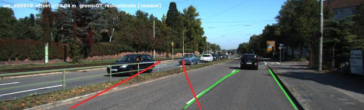
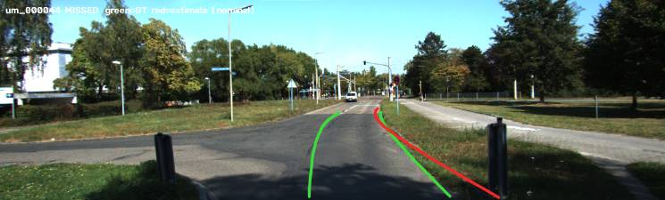
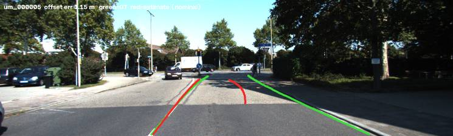
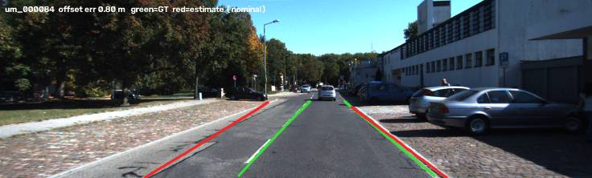

# Failure modes

Documented conditions under which each stage breaks, with frames. A stage
without a failure set has not been characterised — it has only been demoed.

Populated by `/failure-hunt`, which sweeps the split for worst-case frames rather
than waiting for one to be noticed.

---

## Ground truth (Phase 1)

### FM-1 · Occlusion: the estimator measures the occluder · **CONFIRMED**

**Condition:** a labelled object is partly or fully occluded by a nearer object
overlapping its 2D box.

**Behaviour:** the depth estimator returns a precise, confident, *wrong* value —
the occluder's range. Measured MAE **11.86 m** on fully-occluded boxes
(N=79, dev split) against 0.10 m on visible ones.

**Worst observed:** `drive_0013`, frames 100–104, track 8 — a car labelled at
52.8–57.6 m read as 21.9–26.6 m. The system was measuring the parked car in
front of it, with no signal that anything was wrong.

**Handling:** abstention via the GT validity tier ([D-010](decisions.md)).
Not fixable by a better estimator — you cannot range-find what you cannot see.

### FM-2 · Truncation: amodal label vs modal sensor · **CONFIRMED**

**Condition:** an object is clipped by the image border.

**Behaviour:** the label's 3D box is amodal and its near face may lie outside the
image, while LiDAR only sees the visible portion. The estimate reads **long** —
measured bias **+2.2 m**.

**Handling:** abstention. Same gate, different mechanism.

### FM-3 · Sparse support at range · **CONFIRMED**

**Condition:** LiDAR returns per box fall as ~1/range².

**Behaviour:** median returns per box drop from 1887 (0–10 m) to 24 (50+ m). Below
8 supporting returns the estimator abstains, so ground-truth coverage itself
degrades with range.

**Handling:** abstention plus a reported coverage column. The attempted
workaround — widening the sampling window — made things 12× worse
([D-011](decisions.md)).

### FM-4 · Two surfaces in one box: bimodal error beyond 50 m · **CONFIRMED**

**Condition:** a 2D box contains returns from the object *and* from something in
front of or behind it, without the annotator flagging occlusion.

**Behaviour:** the percentile reduction returns one surface with full confidence
and no signal about which. Error becomes **bimodal**: on val beyond 50 m, median
|error| 0.12 m but MAE 4.75 m — 83% of boxes under 1 m, 14% over 5 m, p99 66 m.

**Detection:** the interquartile depth spread separates the populations 47×
(0.248 m on correct boxes, 11.65 m on failures). Point count does **not** —
failures had *fewer* points than successes, so the intuitive gate is backwards.

**Handling:** abstain above 1.5 m spread ([D-013](decisions.md)). Residual failure
rate 0.27%, and 27% of 50+ m boxes are given up to achieve it.

### FM-5 · Ego pitch excursion and standing offset · **CONFIRMED**

**Condition:** ordinary city driving. No hard braking required.

**Behaviour:** measured peak-to-peak pitch of **2.011°** (`0084`) and **2.221°**
(`0091`), at or above the level stated to cost >10% range error. `0084` also
carries a **sustained +1.026° mean** — a systematic range bias across an entire
drive that no temporal filter removes.

**Handling:** undecided, and blocking Phase 3 ([D-009](decisions.md)). Either
estimate camera pitch from the horizon row or publish a measured sensitivity
curve. Note the dev drive showed only 1.05° and would have understated this.

---

## Detection (Phase 2)

### FM-6 · VRU recall collapses beyond 30 m · **CONFIRMED**

**Condition:** pedestrians and cyclists past ~30 m, YOLOv8n at 640 px.

**Behaviour:** recall by range 75% / 69% / 36% / **2%** / **0%** across
0–10 / 10–20 / 20–30 / 30–50 / 50+ m. Vehicles at the same ranges hold
91 / 79 / 72 / 50 / 25%.

**Why it matters more than the vehicle numbers:** VRUs are the safety-critical
class — a missed detection is a person. Any FCW claim about VRUs is bounded at
about 30 m by detection alone, before geometry enters.

**Mechanism:** apparent size, not range. Recall tracks pixel height (31% below
25 px, 81% above 80 px), and a pedestrian subtends far fewer pixels than a car at
the same distance.

### FM-7 · Latency stalls exceeding the budget by 5x · **CONFIRMED**

**Condition:** five frames of 1450 on val (0.34%).

**Behaviour:** 180 / 216 / 235 / 259 / **553 ms** against a 103.56 ms budget,
where p50 is 17 ms and the mean excluding them is 16.73 ms. Scattered through the
run (indices 32, 871, 1132, 1195, 1399), so not a per-drive warmup artefact —
these look like host-level stalls.

**Why it is recorded:** the p99 (34 ms, 33% of budget) hides them completely. On a
real system each stall is a dropped frame, and a dropped frame during a closing
manoeuvre is the case the system exists for.

### FM-8 · Occlusion halves detection recall · **CONFIRMED**

81% visible → 53% partly occluded → 21% fully occluded. Compounds with FM-1:
occluded objects are both harder to detect *and* impossible to ground-truth,
which is why the compound coverage in Row 2.6 is what bounds Phase 3.
## Monocular range (Phase 3)

### FM-9 · The near field is the WORST field · **CONFIRMED**

**Condition:** objects inside 10 m.

**Behaviour:** MAPE **22.7%** (contact-point) and **29.5%** (size-prior) — worse
than any other bin, including 50+ m. The error curve is U-shaped, not monotonic.

**Why it matters:** a collision-warning system is least accurate exactly where a
collision is most imminent. This is the single most uncomfortable result in the
project and is reported in the README rather than buried.

**Mechanism:** partly FM-10 (~17% of the near-field bias). **The rest is unexplained** — the most important open question in the project ([D-018](decisions.md)).

### FM-10 · Detector boxes are systematically undersized · **CONFIRMED**

**Condition:** all ranges; worst inside 10 m.

**Behaviour:** measured per object against its own label box (5254 pairs), the
detector box is **−4.5% short overall and −7.1% inside 10 m**, with the bottom
edge sitting **4.8 px high** in the near field. Both estimators inherit it as a
range over-estimate.

*(An earlier figure of −12% compared implied height to a class mean and
overstated this 2.6× — [D-018](decisions.md).)*

**Why it is worse than noise:** it is a **bias**. Temporal filtering and the
Phase 5 Kalman filter reduce jitter and will not touch this.

**But it does not explain FM-9.** Converted to a range bias it accounts for ~80%
of the mid-range error and only **~17% of the near-field error**. The near-field
cause is still unidentified.

### FM-11 · Boxes clipped at the image edge · **CONFIRMED**

4.2% of detections, **46.4% MAPE against 13.6%**. The contact point lies outside
the picture and the pixel height is truncated. Both estimators now abstain
([D-017](decisions.md)).

### FM-12 · Pitch is a real term that is currently invisible · **CONFIRMED**

Stratifying by measured camera-to-road pitch gives a **flat** error curve
(14.1 / 15.6 / 13.8 / 14.7%) where the geometry predicts an 8× span
(3.2 → 25.3%). Pitch is not wrong — it is masked by FM-10. **If the box bias is
ever fixed, pitch becomes the next binding constraint**, and the sensitivity
curve in Row 3.4 is what says so.

## Tracking (Phase 4) — not yet characterised
## Lane detection (Phase 6)

Images: `docs/figures/lanes/` — green = labelled lane, red = estimate (nominal
geometry). Scored on 95 KITTI road-benchmark frames ([D-023](decisions.md)).

### FM-13 · Lane straddling: the metric charges a lane width for a convention · **CONFIRMED**

**Frames:** `um_000010`, `um_000045` — the only two where the camera centreline is
outside the labelled ego lane. **Offset error ~4 m each, departure warning
correct in both.** The estimator's nearer boundary is the line being crossed; it
reports the lane the centreline is in, the label reports the lane being entered.
Offset MAE is 0.26 m with these frames and 0.18 m without.

### FM-14 · A boundary lost entirely beside the vehicle · **CONFIRMED**

**Frames:** `um_000004` (right boundary beside parked cars), `um_000044` (vehicle
on the left line, which shows almost no marking response — coverage 0.04).
**Both are body-over-line departure frames, and both warnings were missed** — the
two misses among the five that matter.

### FM-15 · A marking inside a widening lane taken as a boundary · **CONFIRMED**

**Frame:** `um_000005`. The labelled lane widens to 5.0 m; a marking inside it is
taken as the right boundary. Offset error 1.15 m and a **false departure
warning**.

### FM-16 · Threshold grazing makes a per-frame warning a coin flip · **CONFIRMED**

8 of 13 warning-rule frames clear the 1.11 m threshold by 0.01–0.09 m, against
~0.18 m lateral error. Their warnings are 2/8 caught. Not a detector failure — a
property of scoring a noisy estimate against a hard threshold.

### FM-17 · The strongest stripe wins over the nearest boundary · **CONFIRMED**

**Frames:** `um_000084`, `um_000016` (dashed ego boundary skipped for the next
solid line out), `um_000043` (a fully visible boundary skipped for a shadowed
verge edge). Estimated lane width inflates to 4.2–5.9 m against 3.2–3.6 m
labelled.

**Mechanism:** each boundary's base is the argmax of marking pixels over a
0.4–2.8 m band. A dashed line contributes about a third of the pixels of a
continuous line or a long shadow edge, so the strongest candidate in the band
beats the nearer, correct one. The skipped boundaries were visible (coverage
0.50–1.00, against a p10 of 0.54 over all 190 labelled edges).

**Fix identified, not applied:** choose the nearest peak above a minimum rather
than the strongest. Applying it now would be tuning on the only labelled lane set
([D-023](decisions.md)); it needs new labelled data to be evaluated credibly.

*Correction to the first visual read:* `um_000043` was initially described as an
unmarked edge. Its labelled right edge has full marking coverage (1.00).

### Not characterised

Conditions absent from this urban daytime set — night, rain, heavy shadow,
construction, sharp curves — remain **uncharacterised**, and naming them is not
characterising them.

## FCW (Phase 7) — not yet characterised
